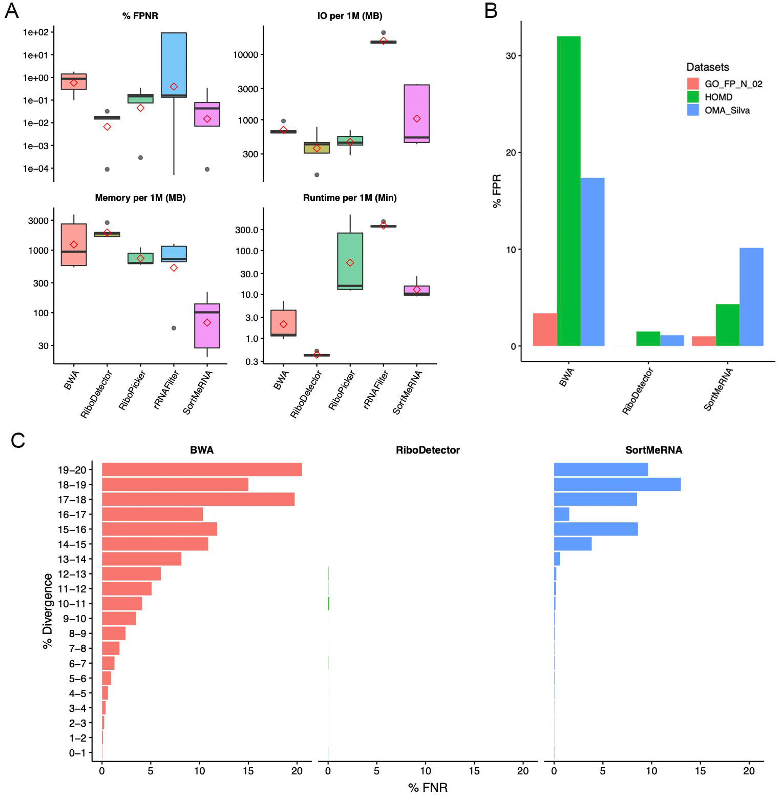

## RiboDetector - Accurate and rapid rRNA sequence detector based on deep learning

### About RiboDetector


`RiboDetector` detects and removes rRNA sequences from metagenomic, metatranscriptomic, and ncRNA sequencing data. It is based on LSTMs and optimized for both GPU and CPU usage, with reported speedups of ~**10×** on CPU and ~**50×** on a consumer GPU compared to prior tools. It is also accurate, with ~**10×** fewer false classifications, and shows low bias across GO functional groups.


### Prerequisites

#### 1. Create a `conda` env and install Python 3.8–3.12

RiboDetector supports Python 3.8–3.12. Example:
```shell
conda create -n ribodetector python=3.10
conda activate ribodetector
```

#### 2. Install PyTorch in the ribodetector env if GPU is available

To install PyTorch compatible with your CUDA driver, follow:
https://pytorch.org/get-started/locally/. RiboDetector is tested with PyTorch 1.13+ and 2.x (Python 3.12 requires PyTorch 2.2+).

Note: you can skip this step if you don't use GPU

### Installation

#### Using pip

```shell
pip install ribodetector
```

#### Using conda
```shell
conda install -c bioconda ribodetector
```

### Usage

#### GPU mode

#### Example
```shell
ribodetector -t 20 \
  -l 100 \
  -i inputs/reads.1.fq.gz inputs/reads.2.fq.gz \
  -m 10 \
  -e rrna \
  --chunk_size 256 \
  -o outputs/reads.nonrrna.1.fq outputs/reads.nonrrna.2.fq
```
The command line above executes ribodetector for paired-end reads with mean length 100 using GPU and 20 CPU cores. The input reads do not need to be the same length. RiboDetector supports variable-length reads. Setting `-l` to the mean read length is recommended.
To use a custom model, pass `--model-file /path/to/model_base` (omit the `.pth` extension). If not provided, the packaged `model_len70_101` is used.

#### Full help
```shell
usage: ribodetector [-h] [-c CONFIG] [-d DEVICEID] -l LEN -i [INPUT [INPUT ...]]
  -o [OUTPUT [OUTPUT ...]] [-r [RRNA [RRNA ...]]] [-e {rrna,norrna,both,none}]
  [-t THREADS] [-s SEED] [-m MEMORY] [--chunk_size CHUNK_SIZE] [--log LOG]
  [--model-file MODEL_FILE] [-v]

rRNA sequence detector

optional arguments:
  -h, --help            show this help message and exit
  -c CONFIG, --config CONFIG
                        Path of config file
  -d DEVICEID, --deviceid DEVICEID
                        Indices of GPUs to enable. Quotated comma-separated device ID numbers. (default: all)
  -l LEN, --len LEN     Sequencing read length. Note: the accuracy reduces for reads shorter than 40.
  -i [INPUT [INPUT ...]], --input [INPUT [INPUT ...]]
                        Path of input sequence files (fasta and fastq), the second file will be considered 
                        as second end if two files given.
  -o [OUTPUT [OUTPUT ...]], --output [OUTPUT [OUTPUT ...]]
                        Path of the output sequence files after rRNAs removal (same number of files as input).
                        (Note: 2 times slower to write gz files)
  -r [RRNA [RRNA ...]], --rrna [RRNA [RRNA ...]]
                        Path of the output sequence file of detected rRNAs (same number of files as input)
  -e {rrna,norrna,both,none}, --ensure {rrna,norrna,both,none}
                        Ensure which classification has high confidence for paired end reads.
                        norrna: output only high confident non-rRNAs, the rest are classified as rRNAs;
                        rrna: vice versa, only high confident rRNAs are classified as rRNA and the rest output as non-rRNAs;
                        both: both non-rRNA and rRNA prediction with high confidence;
                        none: give label based on the mean probability of read pair.
                              (Only applicable for paired end reads, discard the read pair when their predictions are discordant)
  -t THREADS, --threads THREADS
                        number of threads to use. (default: 10)
  -s SEED, --seed SEED  Random seed.
  -m MEMORY, --memory MEMORY
                        Amount (GB) of GPU RAM. (default: 12)
  --chunk_size CHUNK_SIZE
                        Use this parameter when having low memory. Parsing the file in chunks.
                        Not needed when free RAM >=5 * your_file_size (uncompressed, sum of paired ends).
                        When chunk_size=256, memory=16 it will load 256 * 16 * 1024 reads each chunk (use ~20 GB for 100bp paired end).
  --log LOG             Log file name
  --model-file MODEL_FILE
                        Model file path without extension (uses .pth). Default: packaged model_len70_101.
  -v, --version         Show program's version number and exit
```

#### CPU mode

#### Example
```shell
ribodetector_cpu -t 20 \
  -l 100 \
  -i inputs/reads.1.fq.gz inputs/reads.2.fq.gz \
  -e rrna \
  --chunk_size 256 \
  -o outputs/reads.nonrrna.1.fq outputs/reads.nonrrna.2.fq
```
The command line above executes ribodetector for paired-end reads with mean length 100 using 20 CPU cores. The input reads do not need to be the same length. RiboDetector supports variable-length reads. Setting `-l` to the mean read length is recommended. If you need to save the log into a file, you can specify it with `--log <logfile>`.
To use a custom model, pass `--model-file /path/to/model_base` (omit the `.onnx` extension). If not provided, the packaged `model_len70_101` is used.

Note: when using **SLURM** job submission system, specify `--cpus-per-task` to the number of CPU cores you need and set `--threads-per-core` to 1.

#### Full help

```shell

usage: ribodetector_cpu [-h] [-c CONFIG] -l LEN -i [INPUT [INPUT ...]]
  -o [OUTPUT [OUTPUT ...]] [-r [RRNA [RRNA ...]]] [-e {rrna,norrna,both,none}]
  [-t THREADS] [-s SEED] [--chunk_size CHUNK_SIZE] [--log LOG]
  [--model-file MODEL_FILE] [-v]

rRNA sequence detector

optional arguments:
  -h, --help            show this help message and exit
  -c CONFIG, --config CONFIG
                        Path of config file
  -l LEN, --len LEN     Sequencing read length. Note: the accuracy reduces for reads shorter than 40.
  -i [INPUT [INPUT ...]], --input [INPUT [INPUT ...]]
                        Path of input sequence files (fasta and fastq), the second file will be considered as 
                        second end if two files given.
  -o [OUTPUT [OUTPUT ...]], --output [OUTPUT [OUTPUT ...]]
                        Path of the output sequence files after rRNAs removal (same number of files as input).
                        (Note: 2 times slower to write gz files)
  -r [RRNA [RRNA ...]], --rrna [RRNA [RRNA ...]]
                        Path of the output sequence file of detected rRNAs (same number of files as input)
  -e {rrna,norrna,both,none}, --ensure {rrna,norrna,both,none}
                        Ensure which classification has high confidence for paired end reads.
                        norrna: output only high confident non-rRNAs, the rest are classified as rRNAs;
                        rrna: vice versa, only high confident rRNAs are classified as rRNA and the rest output as non-rRNAs;
                        both: both non-rRNA and rRNA prediction with high confidence;
                        none: give label based on the mean probability of read pair.
                              (Only applicable for paired end reads, discard the read pair when their predictions are discordant)
  -t THREADS, --threads THREADS
                        number of threads to use. (default: 20)
  -s SEED, --seed SEED  Random seed.
  --chunk_size CHUNK_SIZE
                        chunk_size * 1024 reads to load each time.
                        When chunk_size=1000 and threads=20, consuming ~20G memory, better to be multiples of the number of threads.
  --log LOG             Log file name
  --model-file MODEL_FILE
                        Model file path without extension (uses .onnx). Default: packaged model_len70_101.
  -v, --version         Show program's version number and exit
```

**Note**: RiboDetector uses multiprocessing with shared memory, so the memory use of a single process shown in `htop` or `top` is actually the total memory used by RiboDetector. Some job submission systems like SGE mis-calculate total memory by adding up all processes. If you see this, it does not necessarily indicate an out-of-memory issue.

<!-- ### Benchmarks

We benchmarked five different rRNA detection methods including RiboDetector on 8 benchmarking datasets as following: 

- 20M paired end reads simulated based on  rRNA sequences from Silva database, those sequences are distinct from sequences used for training and validation.

- 20M paired end reads simulated based on 500K CDS sequences from OMA databases.

- 27,206,792 paired end reads simulated based on 13,848 viral gene sequences downloaded from ENA database.

- 7,917,920 real paired end amplicon sequencing reads targeting V1-V2 region  of  16s rRNA genes from oral microbiome study.

- 6,330,381 paired end reads simulated from 106,880 human noncoding RNA sequences.

- OMA_Silva dataset in figure C contains 1,027,675 paired end reads simulated on CDS sequences which share similarity to rRNA genes, the sequences with identity >=98% and query coverage >=90% to rRNAs were excluded.

- HOMD dataset in figure C has 100,558 paired end reads simulated on CDS sequences from HOMD database which share similarity to the FP sequences of three tools, again sequences with identity >=98% and query coverage >=90% to rRNAs were excluded.

- GO_FP_N_02 in figure C consisting of 678,250 paired end reads was simulated from OMA sequences which have the GO with FP reads ratio >=0.2 on 20M mRNA reads dataset for BWA, RiboDetector or SortMeRNA.



In the above figures, the definitions of *FPNR* and *FNR* are:


RiboDetector has a very high generalization ability and is capable of detecting novel rRNA sequences (Fig. C). -->

### FAQ
1. What should I set for `-l` when I have reads with variable length?
> You can set the `-l` parameter to the mean read length if you have variable-length reads. The mean read length can be computed with `seqkit stats`. This parameter tells how many bases will be used to capture the sequence patterns for classification.  

2. How does `-e` parameter work? What should I set (`rrna`, `norrna`, `none`, `both`)?
> This parameter is only necessary for paired end reads. When setting to `rrna`, the paired read ends will be predicted as rRNA only if both ends were classified as rRNA. If you want to identify or remove rRNAs with high confidence, you should set it to `rrna`. Conversely, `norrna` will predict the read pair as nonrRNA only if both ends were classified as nonrRNA. This setting will only output nonrRNAs with high confidence. `both` will discard the read pairs with two ends classified inconsistently, only pairs with concordant prediction will be reported in the corresponding output. `none` will take the mean of the probabilities of both ends and decide the final prediction. This is also the default setting. 

3. I have very large input file but limited memory, what should I do?
> You can set the `--chunk_size` parameter which specifies how many reads the software loads into memory at once.

4. What should I do if RiboDetector hangs with SLURM?
> The most likely cause is that the requested computational resources are not sufficient for the input file. Make sure you specify `--cpus-per-task` to the number of CPU cores you want to use and set `--threads-per-core` to 1 in the SLURM submission script or command. If the issue remains, you can reduce memory use by setting `--chunk_size` in the `ribodetector` or `ribodetector_cpu` command.

### Citation
Deng ZL, Münch PC, Mreches R, McHardy AC. Rapid and accurate detection of ribosomal RNA sequences using deep learning. <i>Nucleic Acids Research</i>. 2022. (https://doi.org/10.1093/nar/gkac112)

### Acknowledgements
The scripts from the `base` dir were from the template [pytorch-template
](https://github.com/victoresque/pytorch-template) by [Victor Huang](https://github.com/victoresque) and other [contributors](https://github.com/victoresque/pytorch-template/graphs/contributors).
